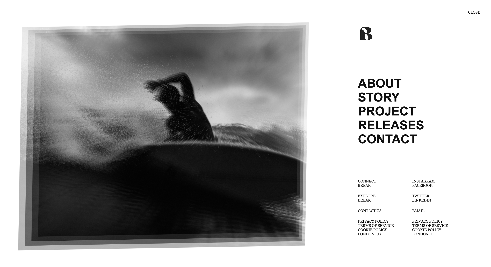

# Fullscreen Overlay Menu

 

This project implements a fullscreen responsive overlay menu with an image parallax effect, utilizing HTML, CSS, JavaScript, and GSAP for animations. It's designed to provide a visually appealing way to navigate through a website, with a focus on simplicity and ease of use.

## Features

- Responsive Design
- GSAP Animations
- Image Parallax Effect
- Easy to Customize

## Getting Started

To use this project in your own work, follow these steps:

1. Clone the repository to your local machine.
2. Open `index.html` in your browser to view the project.
3. Customize the HTML, CSS, and JavaScript files as needed.

## Structure

The project is structured as follows:

- `index.html`: The main HTML document.
- `styles.css`: Contains all the styling for the project.
- `menu.js`: JavaScript for handling the menu opening and closing actions.
- `scripts.js`: Additional JavaScript for other interactive elements.
- `assets/`: Directory containing images used in the project.

## Dependencies

- [GSAP](https://greensock.com/gsap/): Used for animations.

## Author

- [Farid Vatani - Software Engineer](https://github.com/faridvatani)

## Acknowledgments

- GSAP for providing a powerful animation platform.
- All contributors and supporters of this project.

## License

This project is licensed under the MIT License - see the [LICENSE](LICENSE) file for details.